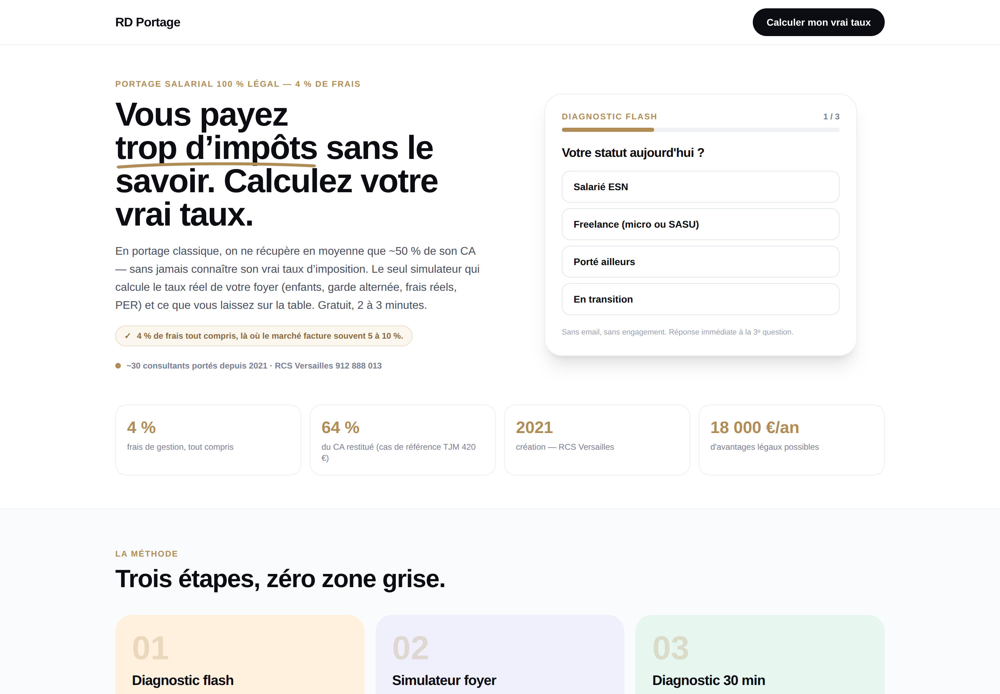
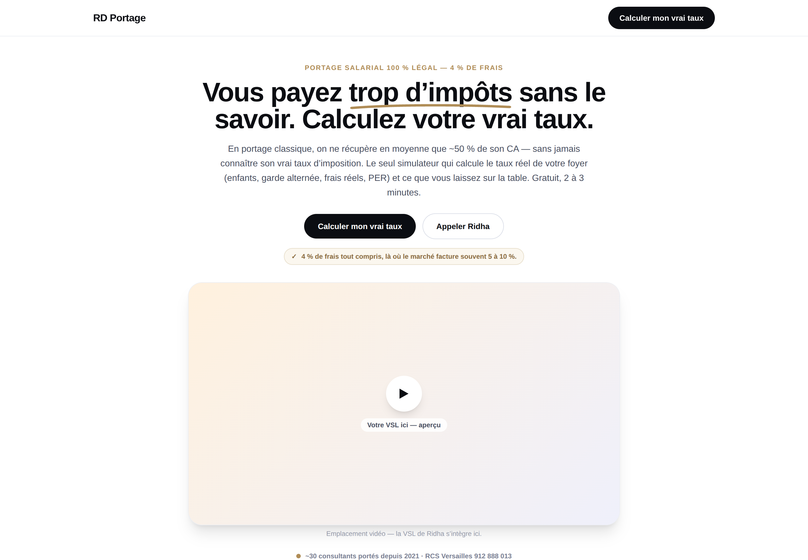

# Brief — Charte graphique des Landing Pages RD Portage

**À : Agent Claude (Cowork)** · **De : équipe RD Portage / Ridchadata**
**Objet : appliquer et étendre la charte des landing pages (et écrans associés)**

> Ce document fait foi pour le style des LP. Les valeurs ci-dessous sont celles
> réellement implémentées (`components/lp/`, `components/simulator/`,
> `config`/Tailwind). Références visuelles : dossier `docs/charte/`.

## Aperçus de référence

| | Desktop | Mobile |
|---|---|---|
| Variante **Flash** (formulaire) | `charte/lp-flash-desktop.png` | `charte/lp-flash-mobile.png` |
| Variante **VSL** (vidéo) | `charte/lp-vsl-desktop.png` | `charte/lp-vsl-mobile.png` |
| Simulateur (même charte) | `charte/simulateur-desktop.png` | — |




## 0. Ton rôle
Tu produis et fais évoluer des landing pages et écrans **dans cette charte, sans
la réinventer**. Style **« fintech clair + fil doré »** : fond clair, beaucoup
de blanc, un accent laiton (or) rare et précieux. Mobile-first, honnête, sobre.
En cas de doute : minimal, et réutilise les composants ci-dessous.

## 1. Principes non négociables
- **Mobile-first** : impeccable à 390 px, puis montée en gamme ≥ 768 px (~83 % du trafic est mobile).
- **Une seule typographie : Manrope. PAS de serif.** Un seul niveau typographique — on joue sur les graisses, pas sur les familles.
- **Honnêteté radicale** : aucune fausse urgence/rareté/compteur, aucun faux témoignage. Tout contenu non validé = placeholder marqué `// TODO: DONNÉE RÉELLE — en attente Ridha`. Garder « simulation à valeur indicative — ne constitue pas un conseil fiscal ». Chaque chiffre est sourcé ou retiré.
- **Accessibilité** : contraste AA, focus visibles (anneau laiton), cibles tactiles ≥ 44 px, `aria-label` sur les contrôles.
- **Animations** : uniquement `transform` / `opacity`, 200–500 ms, **respect de `prefers-reduced-motion`**. Conserver le **count-up** sur le chiffre clé (le gain).

## 2. Palette (hex exacts + usage)
| Rôle | Hex |
|---|---|
| Texte principal / « encre » | `#0B0D12` |
| **Laiton — accent signature** (chiffres clés, eyebrows, fil doré) | `#B08D57` |
| Texte secondaire | `#4A5061` |
| Texte tertiaire / légendes | `#7A8093` |
| Mentions fines / placeholders | `#9AA0B0` |
| Vert validation (résultats positifs) | `#2F6B4F` |
| Fond blanc / off-white sections | `#FFFFFF` / `#FAFBFD` |
| Bordures : cartes / champs / boutons outline | `#ECEEF3` / `#E2E5EE` / `#D8DCE6` |
| **Tints pastel** cartes/sections : pêche / lilas / menthe | `#FFF1DE` / `#EFF0FB` / `#E7F6EE` |
| Puce « preuve » (warm) : fond / bordure / texte | `#FBF7EF` / `#E6DCC8` / `#8A6B3F` |

Règles : le **laiton est rare** — réservé aux chiffres importants, eyebrows et au « scribble ». Jamais sur de grandes surfaces. Le vert `#2F6B4F` est réservé aux résultats/chiffres positifs. **Aucune couleur Tailwind par défaut** (pas de bleu/indigo/violet).

## 3. Typographie
- **Police** : `'Manrope', 'IBM Plex Sans', sans-serif`. Graisses : **800** (titres), **700** (sous-titres, CTA, labels), **600** (légendes), **500** (corps).
- **Échelle** : H1 `text-3xl → md:text-5xl` (30→48 px) ; H2 `text-2xl → md:text-4xl` ; H3 ~`text-xl` ; corps `text-base` (16 px) ; petit `text-xs/sm`.
- **Eyebrow** (sur-titre) : `text-xs font-bold uppercase tracking-widest`, couleur laiton.
- **Chiffres** : toujours `tabular-nums`. Titres en casse normale (majuscules réservées aux eyebrows).

## 4. Formes, espacements, grille
- **Rayons** : pills/boutons = `rounded-full` ; cartes = `rounded-2xl` (16 px) / `rounded-3xl` (24 px) ; champs = 12 px.
- **Ombres** : douces (`shadow-sm` au repos, `shadow-xl` pour l'élément focal — carte formulaire / lecteur vidéo).
- **Container** : largeur max **1140 px** (`max-w-page`), padding latéral `px-4`.
- **Sections** : `py-12` à `py-16` ; bandes alternées sur `#FAFBFD` avec bordures `#ECEEF3`.
- **Grille hero** : 2 colonnes ≥ 768 px (`md:grid-cols-2`), **empilées** en dessous.

## 5. Composants standards
- **CTA primaire** : `rounded-full`, fond `#0B0D12`, texte blanc, `px-6 py-3`, `font-bold`, hover `-translate-y-0.5` + ombre. **Un seul CTA primaire par page**, libellé orienté bénéfice (« Calculer mon vrai taux »).
- **CTA secondaire (outline)** : fond blanc, bordure `#D8DCE6`, texte encre, `rounded-full`, hover → bordure laiton.
- **Carte** : fond blanc (ou tint pastel), bordure `#ECEEF3`, `rounded-2xl/3xl`, padding 20–32 px.
- **Puce preuve** : pastille `rounded-full` warm (`#FBF7EF`/`#E6DCC8`/`#8A6B3F`) avec ✓ — une preuve courte et sourcée.
- **Scribble (fil doré)** : court trait laiton en SVG sous un mot-clé du titre (stroke `#B08D57`, largeur ~5, bouts arrondis). Accent signature — 1× par section max.
- **Champs** : fond blanc, bordure `#E2E5EE`, rayon 12 px, focus → bordure laiton + halo `rgba(176,141,87,.15)`. `inputmode="numeric"` pour les nombres.
- **Sliders / steppers** : piste laiton clair, pouce encre cerclé de blanc ; steppers en boutons ronds ≥ 44 px.
- **Stat chips** : grille 2 (mobile) → 4 (desktop), chiffre en laiton, libellé en `#7A8093`.
- **Lecteur VSL** : cadre `aspect-video`, `rounded-3xl`, dégradé pêche→lilas, bouton play blanc centré. Placeholder marqué tant que la vidéo n'est pas fournie.

## 6. Layouts des LP (2 variantes à conserver)
- **Flash** (défaut) : hero « split » — accroche à gauche, **diagnostic flash 3 questions** dans une carte à droite (le formulaire = mécanisme de conversion).
- **VSL** : hero **centré** — accroche, double CTA, **lecteur vidéo 16:9**, puis le diagnostic flash juste en dessous.
- **3 angles de message** (seul le bloc above-the-fold change) : A Warning · B Vrai net · C Fondateur ; corps de page commun.
- Trafic payant : **pas de navigation** (logo + 1 CTA).

## 7. Garde-fous (à coder)
Placeholders marqués pour témoignages / logos / chiffres non validés ; aucune fausse urgence ; mentions légales + « simulation indicative » présentes ; consentement RGPD avant tout pixel marketing.

## 8. Tokens prêts à l'emploi
```css
:root{
  --ink:#0B0D12; --brass:#B08D57; --valide:#2F6B4F;
  --txt-2:#4A5061; --txt-3:#7A8093; --txt-4:#9AA0B0;
  --bg:#FFFFFF; --bg-soft:#FAFBFD;
  --border:#ECEEF3; --border-field:#E2E5EE; --border-btn:#D8DCE6;
  --peach:#FFF1DE; --lilac:#EFF0FB; --mint:#E7F6EE;
  --proof-bg:#FBF7EF; --proof-border:#E6DCC8; --proof-txt:#8A6B3F;
  --font-sans:'Manrope','IBM Plex Sans',sans-serif;
  --radius-card:24px; --radius-field:12px; --maxw:1140px;
}
```
```js
// Tailwind (extrait)
colors: { ink:'#0B0D12', brass:'#B08D57', valide:'#2F6B4F',
  peach:'#FFF1DE', lilac:'#EFF0FB', mint:'#E7F6EE' }
fontFamily: { sans:['Manrope','IBM Plex Sans','sans-serif'] }
maxWidth: { page:'1140px' }
```

## 9. À faire / à éviter
**Faire** : blanc dominant, laiton parcimonieux sur les chiffres, Manrope partout, cartes douces, mobile d'abord, 1 CTA primaire/écran, count-up sur le gain.
**Éviter** : serif, dégradés criards, bleu/indigo Tailwind par défaut, fausse urgence, laiton sur grandes surfaces, formulaires denses (1 décision/écran), animations hors `transform/opacity`.
